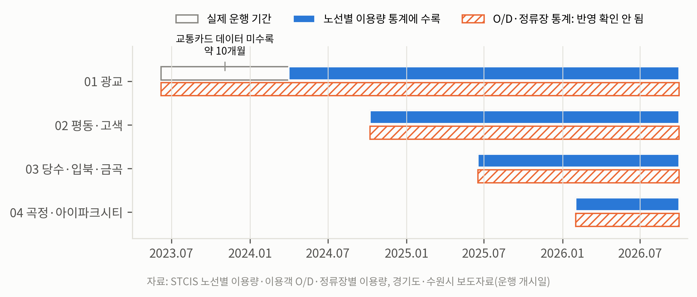

# 보이지 않는 버스: DRT 효과 평가의 데이터 사각지대

**수원시 똑버스 사례로 본 수요응답형 교통(DRT) 평가의 한계와 개선 방향**

경기도 수요응답형 교통 **똑버스**가 자가용 이용을 줄이는지 검증하려 했으나, 현재 공공 교통 데이터로는 그 질문에 답할 수 없음을 확인했습니다. 이 레포는 (1) 데이터로 확인되는 것, (2) 데이터가 보여주지 못하는 것과 그 근거, (3) 현재 데이터로 가능한 최선의 추정을 재현 가능한 코드로 정리합니다.

> 숲과나눔·한겨레 「데이터로 바꾸는 우리의 이동」 교통 데이터 분석 공모전 출품작

주요 결과는 [`docs/findings.md`](docs/findings.md)에 정리했습니다.



## 핵심 결과

| | 내용 |
|---|---|
| 보이는 것 | 4개 노선 하루 약 2,000명. 02는 평일 이용이 주말의 2.1배(출근·역 연계), 03은 방학 중 등하교 시간대 이용이 27% 감소(통학 성분) |
| 보이지 않는 것 | 01번은 운행 후 10개월간 교통카드 데이터에 없음. 카드 데이터 편입 후에도 O/D·정류장 통계에는 반영되지 않는 것으로 추정(간접 증거 3개). 자동차 등록은 동 단위가 없고 구 단위는 등록지 왜곡 |
| 최선의 추정 | 가정 하에서 똑버스 이용 중 기존 대중교통에서 넘어온 비율 0~36% (참고용) |
| 탄소 | 똑버스가 탄소를 줄이려면 이용자 중 자가용 출신이 경유 차량은 중앙 가정에서 100% 초과(전원이 자가용 출신이어도 부족할 수 있음), 전기 차량 기준 약 42% 이상이어야 함. 현재 데이터로는 이 조건 충족 여부를 알 수 없음 |

## 데이터

모두 공개 통계이며 원본을 `data/raw/`에 포함했습니다.

| 폴더 | 출처 | 받는 방법 |
|---|---|---|
| `route_usage/` | [STCIS 교통카드 빅데이터](https://stcis.go.kr) 노선·정류장 지표 → 노선별 이용량 | 지역 수원시, 노선 1개씩, 기간 최대 14일. 파일명 `{노선}_{시작일}_{종료일}.xlsx` |
| `od_monthly/` | STCIS 이용객수요(O/D) 지표 | 출발 읍면동 1개 선택, 도착 전체, 기간 1개월(월 합계). 파일명 `od_{출발동}_{YYYY-MM}.xlsx` |
| `car_registration/` | [국토교통 통계누리](https://stat.molit.go.kr) 자동차등록대수현황 시군구별 | 2022-01 ~ 2026-08, CSV |
| `population/` | [행정안전부 주민등록 인구통계](https://jumin.mois.go.kr) | 수원시 구·행정동, 월간, 2022-01 ~ 2026-08 |

STCIS Open API(15분단위 OD)는 초기 검증에 사용했습니다. 사양과 호출 시 주의사항은 [`docs/api_spec.md`](docs/api_spec.md) 참고.

## 실행

```bash
pip install -r requirements.txt
bash run_all.sh        # Windows: run_all.sh 안의 python 명령을 순서대로 실행
```

Windows PowerShell에서 한글 출력이 깨지면 먼저 `$env:PYTHONIOENCODING='utf-8'`를 실행하세요.

## 분석 흐름

| 순서 | 스크립트 | 결과 (`data/processed/`) |
|---|---|---|
| 1 | `merge_route_usage.py` | `route_usage.csv`, `route_usage_daily.csv` |
| 2 | `repair_car_registration.py` | `car_registration_sigungu.csv` — 원본 CSV의 따옴표 없는 천 단위 쉼표를 차종·구분 합계 규칙으로 복원 |
| 3 | `build_population.py` | `population_suwon.csv` |
| 4 | `build_od_monthly.py` | `od_monthly_raw.csv`, `od_monthly_metrics.csv` |
| 5 | `analysis_route_profiles.py` | `route_period_summary.csv`, `route_hourly_weekday.csv`, `vacation_comparison.csv` |
| 6 | `analysis_od_validation.py` | `od_validation_01.csv` — O/D에 똑버스가 포함되는지 01번 자연실험 |
| 7 | `analysis_od_did.py` | `did_results.csv` — 기존 대중교통 잠식률 DiD, 기준월 민감도 |
| 8 | `analysis_car_registration.py` | `car_per_capita_gu.csv` |
| 9 | `analysis_carbon_breakeven.py` | `carbon_breakeven_scenarios.csv`, `carbon_breakeven_curve.csv` — 탄소 손익분기 자가용 대체율 |
| 10 | `make_figures.py` | `figures/fig1~5.png` |

공통 설정(운행 구역 법정동, 비교군, 운행 개시일, 공휴일)은 `src/config.py`에 있습니다.

### 운행 구역 정의

똑버스는 STCIS에 노선마다 기점·종점만 등록되어 있어 정류장 네트워크를 재구성할 수 없습니다. 그래서 노선별 운행 구역을 법정동 단위로 정의했습니다 (`data/processed/ddok_zone_dongs.csv`).

| 노선 | 운행 구역(법정동) | 운행 개시 |
|---|---|---|
| 01 광교 | 이의동, 하동, 상광교동, 하광교동 | 2023-06-07 |
| 02 평동·고색 | 평동, 고색동, 오목천동 | 2024-10-08 |
| 03 당수·입북·금곡 | 금곡동, 당수동, 입북동 | 2025-06-17 |
| 04 곡정·아이파크시티 | 권선동, 곡반정동 | 2026-02-01 |

비교군: 정자동, 조원동, 매탄동, 세류동 (똑버스 미운행 주거지)

### 초기 검증 스크립트 (API)

| 파일 | 설명 |
|---|---|
| `src/test_od_api.py` | 15분단위 OD API 동작 확인 (읍면동 단위, 과거 데이터 범위) |
| `src/build_ddok_stops.py` | 똑버스 노선별 등록 지점과 좌표 → `ddok_stops.csv` |
| `src/verify_od_zone_test.py` | 02번 도입 전후 처리군·비교군 OD 비교 (API) |
| `src/verify_od_gwanggyo_test.py` | 01번 광교 통행 포함 여부 (API, 웹 O/D로 대체) |

## 한계

- O/D에 똑버스가 빠져 있다는 판단은 간접 증거에 근거하며 운영기관 확인 전입니다.
- 잠식률 추정은 비교군 평행추세 가정에 의존하고, 효과 크기가 월별 변동과 비슷해 범위로만 제시합니다.
- 노선별 이용량은 승차 기준이며 이용자 유형(청소년 등) 구분이 공개되지 않습니다.
