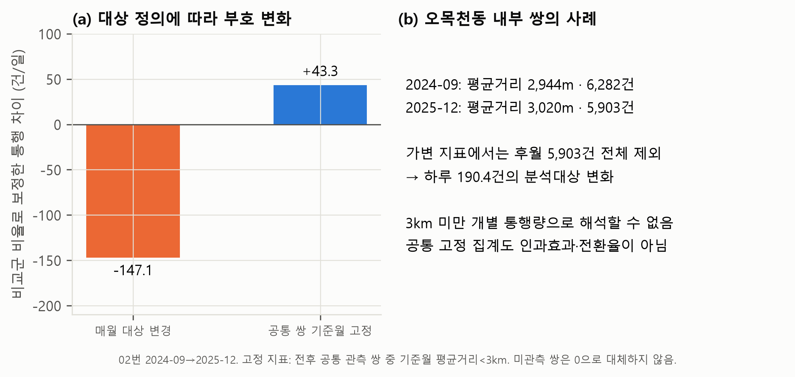

# 보이지 않는 버스: 공개데이터로 본 수원 똑버스의 평가 한계와 개선 방향

숲과나눔·한겨레 [AI와 함께하는 교통문제 해결을 위한 데이터 분석 공모전](https://koreashe.org/notice/?mod=document&uid=95427) 분석 프로젝트입니다. 수원 똑버스의 이용 패턴을 정리하고, 공개 집계의 정의와 분석대상 선택이 결과를 어떻게 바꾸는지 검증합니다. 개인의 수단전환율과 인과적 탄소 감축량은 추정하지 않습니다.

## 핵심 결과

- 2026-09-01~14의 4개 노선 합계는 하루 평균 약 2,015건입니다. 중복 없는 이용자 수가 아닙니다.
- 02번 2024-09→2025-12 O/D 비교에서 월별 평균거리<3km 대상은 보정 차이 −147.1건/일, 전후 공통 쌍을 기준월 거리로 고정한 대상은 +43.3건/일입니다. 두 집계는 대상이 달라지며 인과효과가 아닙니다.
- O/D 평균거리는 개별 통행거리 분포가 아닙니다. 미관측 쌍은 0으로 채우지 않습니다.
- 01번의 공식 정식 개통(2023-06-07)과 작성자 STCIS 조회 시작(2024-04)에는 약 10개월 차이가 있습니다. 조회 공백의 원인·소급 갱신 여부와 O/D의 DRT 포함·환승·위치 귀속은 기관 확인이 필요합니다.
- 일반 승합차 운행 조건을 가정한 탄소 손익분기 자가용 대체 **직결 여객km** 비중은 중앙값 경유 111%, 전기 42%입니다. 실제 노선 성과나 이용자 비율이 아닙니다.



상세 결과: [docs/findings.md](docs/findings.md). 양식별 보고서 문안: [docs/submission_report.md](docs/submission_report.md). 기관 문의 초안: [docs/inquiry_drafts.md](docs/inquiry_drafts.md).

## 데이터와 재현

공개 다운로드 원본은 `data/raw/`에 있습니다. 원본 목록·SHA256은 `data/processed/source_manifest.csv`에 기록하며, 수집 시각은 미기록으로 표시합니다. 목록에는 보조·초기 검증 자료도 포함되어 있습니다.

| 자료 | 제공기관·플랫폼 | 분석 범위 |
|---|---|---|
| 노선별 이용량 | 국토교통부·한국교통안전공단, [STCIS](https://stcis.go.kr) | 27개 엑셀, 2024-05~2026-09 중 선택 기간, 노선별 3~14일 등 |
| 읍면동 O/D | STCIS | 48개 엑셀, 2024-03·05·09, 2025-04·05·12 중 출발동별 선택 자료 |
| 자동차등록현황 | 국토교통부, [국토교통 통계누리](https://stat.molit.go.kr) | 2022-01~2026-08 시군구별 |
| 주민등록인구 | 행정안전부, [주민등록 인구통계](https://jumin.mois.go.kr) | 2022-01~2026-08 수원 구·동 |
| 이용자유형별 버스 수단통행량 | STCIS | 2025-09-01~14, 평일 집계 보조 비교 |

Python 3.12에서 검증했습니다. 인터넷/API 키 없이 보관 원본으로 본 분석을 실행할 수 있습니다.

```bash
python -m pip install -r requirements.txt
python run_all.py
python -m unittest discover -s tests -v
```

Windows 실행 래퍼는 `.\run_all.ps1`, Bash 래퍼는 `bash run_all.sh`입니다. 모두 같은 `run_all.py`를 실행합니다.

Windows PowerShell 한글 출력 설정: `$env:PYTHONIOENCODING='utf-8'`. Linux/macOS에서는 `bash run_all.sh`도 같은 파이프라인을 실행합니다. 한글 그림에는 맑은 고딕·AppleGothic·나눔고딕·Noto Sans CJK 중 하나가 필요합니다.

## 실행 흐름

`run_all.py`는 다음 12단계를 순서대로 실행하고 실패하면 중단합니다.

1. `merge_route_usage`: 원본 시간대 합계·요일 검증, 충돌 중복 거부, 휴일·시범운행 표시
2. `repair_car_registration`: 합계 제약으로 CSV 복원, 실패 행 발생 시 중단
3. `build_population`: 수원 인구 정리
4. `build_od_monthly`: O/D 전체 지역 키·수치 검증, 지표 집계
5. `analysis_route_profiles`: 관측일수·평일·주말·시간대·계절별 비교
6. `analysis_od_validation`: 광교 관측 변화와 가정별 포착 시나리오 분리
7. `analysis_od_did`: 240개 탐색적 조합, 수준 차분·비율 보정 차이, 거리·비교군 민감도
8. `analysis_car_registration`: 구별 인구당 자동차 등록 재고
9. `analysis_carbon_breakeven`: 가정표·조건부 손익분기·단일 변수 민감도
10. `analysis_user_type`: 시기·요일이 다른 이용자 유형 보조 비교
11. `analysis_quality`: 원본 해시, 중복·합계 검증, 실행 환경 기록
12. `make_figures`: 보고서 그림 5개

검증 결과는 `data/processed/quality_checks.json`, 거리 대상 포착률은 `od_pair_coverage.csv`, 경계 이동은 `od_distance_crossings.csv`에 저장합니다. 자료 없는 똑버스 월 평균은 보간하지 않습니다.

## 공간·기간 해석

분석 구역은 노선 운영 범위를 법정동으로 근사한 것이며 개별 승차 좌표가 아닙니다. 비교 출발동은 정자·조원·매탄·세류동입니다. 구역내 지표에서는 처리군의 여러 동 간 통행과 비교군의 동내 통행 범위가 다를 수 있어 동내부 지표도 별도로 비교합니다. 미운행 및 반사실 대표성은 기관·운영 변경 자료로 추가 확인해야 합니다. sparse한 선택 월로 평행추세를 입증하지 않았습니다.

2025-06-10~14의 03번 자료는 시범운행입니다. [경기도 발표](https://gnews.gg.go.kr/briefing/brief_gongbo_view.do?BS_CODE=s017&number=66228&subject_Code=BO01)는 6월 17일 정식 개통을 명시합니다. 관측이 연속 전 기간을 포괄하지 않으므로 정착에 필요한 최소 기간을 단정하지 않습니다.

## 한계와 추가 자료

이용 건수로 이전 교통수단·통행 목적·청소년 이동권 개선을 확정할 수 없습니다. 계절 차이에는 날씨·학교 일정·운영 변경 등이 함께 작용할 수 있습니다. 자동차 등록은 실제 자동차 통행량이 아닙니다. 탄소 모델은 경유 연소CO2·전력 소비단CO2eq의 운영 배출 근사 비교하며 공차·우회·거리 평균 재차인원·운영 조건은 가정이며 전력계수는 공식 소비단 계수입니다. 조사 응답자 비중과 대체 여객km 비중도 구분합니다.

초기 API 실험 스크립트와 [docs/api_spec.md](docs/api_spec.md)는 참고 자료이며 전체 재현 단계에 포함되지 않습니다. 호출 제한 경험을 공식 사양으로 해석하지 않습니다.


01번: 공식 정식 개통 2023-06-07, 작성자 STCIS 조회 시작 2024-04의 약 10개월 차이를 `fig2_data_blindspot.png`에 표시합니다. 소급 수록·원인은 기관 확인 전입니다. 광교 청소년 비중 20.3%와 일반 버스 5.7%는 시기·요일이 다른 보조 비교입니다. 경유 중앙은 공차 비율 0일 때 79%, 0.4일 때 111%이며 전체 불확실성 범위가 아닙니다.
