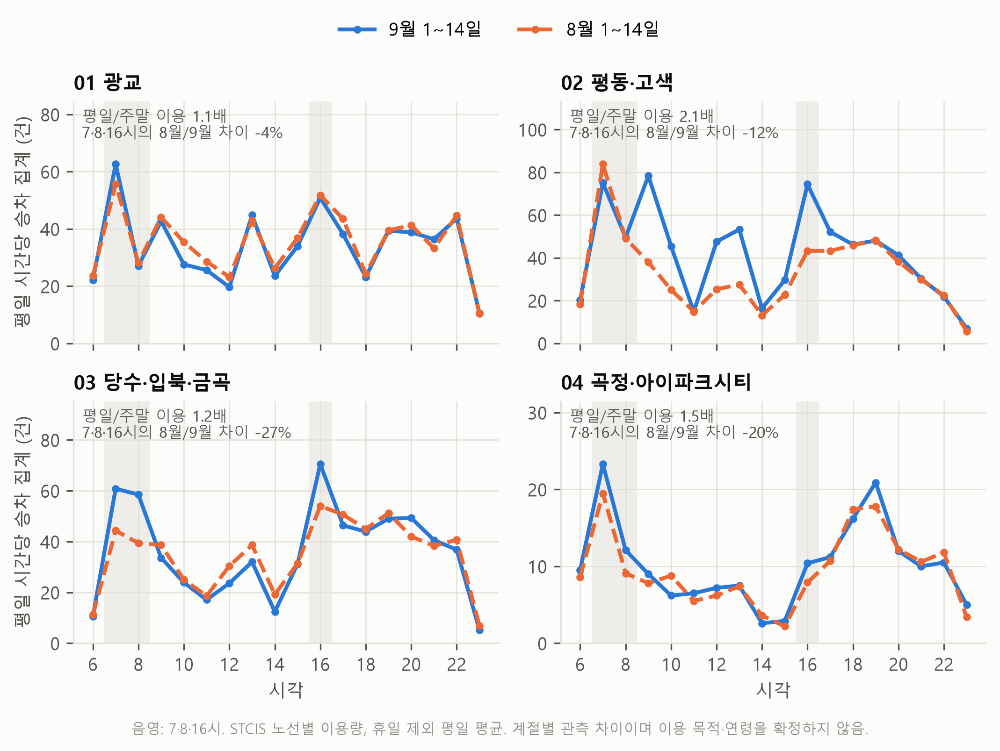
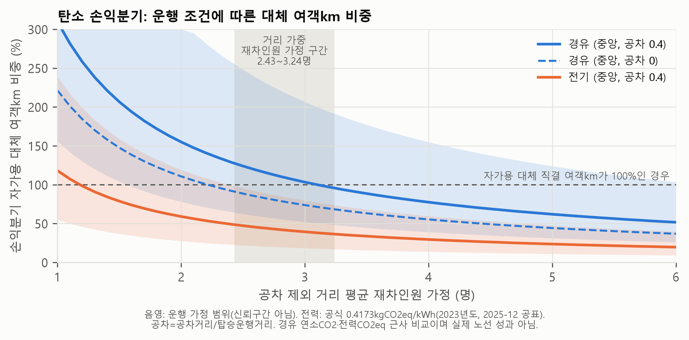

# 이름/팀명

[이름 또는 팀명]

# 주제

보이지 않는 버스: 공개데이터로 본 수원 똑버스의 평가 한계와 이동권·탄소 평가 개선

# 분석 배경 및 목적

수요응답형 교통(DRT)은 정해진 노선 대신 이용자의 호출에 대응해 이동을 제공한다. 대중교통 접근성이 부족한 지역의 이동을 보완할 수 있지만, 이용량 증가만으로 자가용 통행 감소와 탄소 감축까지 확인할 수는 없다. 기존 버스에서 옮겨온 통행, 보호자의 차량 이동을 대체한 통행, 이전에는 하지 못했던 이동은 정책적 의미가 서로 다르기 때문이다.

본 분석은 수원 똑버스가 자동차 이용을 줄이는지 공개데이터로 확인하려는 질문에서 출발했다. 분석 과정에서 지역별 O/D 집계의 평균거리와 개인의 통행거리, 노선 승차 건수와 고유 이용자 수를 구분해야 한다는 문제를 발견했다. 특히 월별 평균거리로 분석 대상을 선정하면 실제 수단전환 외에 대상 구성 변화가 결과에 섞일 수 있다.

이에 수원 똑버스 01~04의 이용 패턴을 분석하고, O/D 지표 정의에 따른 결과의 민감도를 검증했다. 또한 탄소 감축에 필요한 조건을 시나리오로 계산하고, 이동권과 환경 성과를 함께 평가할 수 있는 데이터 수집·공개 체계를 제안한다. 연구의 목적은 확보한 집계자료로 확인되는 결과와 추가 자료가 필요한 효과를 구분해 정책 판단의 근거를 개선하는 것이다.

# 활용 데이터

| 활용 데이터명 | 제공기관 | 출처 플랫폼 | URL |
|---|---|---|---|
| 노선별 이용량, 읍면동 이용객수요 O/D | 국토교통부·한국교통안전공단 | 교통카드빅데이터 통합정보시스템(STCIS) | https://stcis.go.kr |
| 이용자유형별 버스 수단통행량 | 국토교통부·한국교통안전공단 | STCIS | https://stcis.go.kr |
| 자동차등록대수현황, 시군구별 | 국토교통부 | 국토교통 통계누리 | https://stat.molit.go.kr |
| 주민등록 인구 및 세대현황 | 행정안전부 | 주민등록 인구통계 | https://jumin.mois.go.kr |
| 수요응답형 교통수단(DRT) 똑버스 운영현황 및 개선방향 | 수원시정연구원 | 수원시정연구원 연구보고서 | [보고서 원문](https://www.suwon.re.kr/data/file/research_reports/9a18cb18b51051343b55f6e23616a830_xesfPwRZ_400caaf3c448327a279da5bd9f38013338662025.pdf) |
| 경유 탄소배출계수·순발열량 | 한국에너지공단 | EG-TIPS | https://tips.energy.or.kr/carbon/Ggas_tatistics03.do |

노선별 이용량은 2024년 5월~2026년 9월 중 선택 기간의 엑셀 27개를 사용했다. 각 파일의 관측 길이는 다르며 전체 기간의 연속 자료가 아니다. O/D는 출발동별 엑셀 48개로, 2024년 3·5·9월과 2025년 4·5·12월 중 확보한 조합을 분석했다. 자동차·인구 자료의 범위는 2022년 1월~2026년 8월이다. 이용자유형 자료는 2025년 9월 1~14일의 평일 집계로 보조 비교에 사용했다.

STCIS는 실제 승차 규모와 공간별 집계 변화를 확인하기 위해 선정했다. 자동차와 인구는 지역의 장기적인 등록 재고 변화를 파악하는 보조 자료다. 선행 연구는 기존 운영·설문 평가를 검토하기 위해, 배출계수는 탄소 시나리오의 계산 근거로 활용했다. 각 원본은 저장소에 보관하고 파일 해시를 기록했다.

# 분석과정 및 방법

① 전처리 및 품질 검증: 노선별 원본을 노선·날짜·시간대 형식으로 병합하고 시간대 합계와 원본 일별 합계를 대조했다. 결측·문자·음수·소수 이용량과 값이 충돌하는 중복은 오류로 처리했다. 자동차 CSV는 합계 제약으로 복원하고 복원 실패 시 실행을 중단하도록 했다. O/D는 출발·도착의 시도·시군구·동 전체 키로 중복과 수치를 검증했다. 휴일 제외 평일을 표시하고 시범운행과 정식운행을 구분했다.

② 이용 패턴: 동일한 2026년 9월 1~14일의 노선별 일평균과 평일/주말 비율을 비교했다. 8월과 9월에는 각각 휴일 제외 평일 시간대 평균을 구해 7·8·16시 합계와 나머지 시간대를 비교했다. 학교별 일정·날씨·실제 통행 목적은 확보하지 못했으므로 계절별 관측 차이로 해석했다.

③ O/D 민감도: 처리 출발동은 02번의 고색·평·오목천동, 03번의 당수·입북·금곡동이고 비교 출발동은 정자·조원·매탄·세류동이다. 월 합계를 달력 일수로 나눴다. 비율 보정 차이 Δ=T후−T전×(C후/C전)와 수준 차분 (T후−T전)−(C후−C전)을 함께 계산했다. 월별 평균거리<3km 대상과 전후 공통 관측 쌍 중 기준월 평균거리<3km로 고정한 대상을 비교했다. 미관측 쌍은 0으로 채우지 않고 공통 쌍의 포착률을 기록했다.

기준월·비교월 6개 조합, 비교군 5개 구성, 지표 8개를 조합해 240개 결과를 저장했다. 거리 기준 2·3·4km, 동내부·구역내부, 비교군 한 동씩 제외, 5월 포함 여부를 점검했다. 기준월 대상 통행이 0인 경우 비율 보정 불가로 표시했다. 사전 평행추세를 확인할 연속 자료가 부족하므로 인과적 이중차분 추정으로 해석하지 않았다. 관측 없는 월의 똑버스 이용량을 보간해 전환율의 분모로 사용하지 않았다.

④ 탄소 조건: DRT 직결 여객km 중 일반 자가용을 대체한 비중을 s로 정의했다. 손익분기 s*는 DRT 직결 여객km당 운영 배출량을 자가용 회피 배출량으로 나눈 값이다. DRT 배출량은 차량 배출계수×우회계수×(1+공차거리/탑승운행거리)÷공차 제외 거리 평균 재차인원으로 계산했다. 기타 수단의 한계 회피배출은 0으로 가정했다. 경유 연소 CO2와 전력 소비단 CO2eq를 이용한 운영 배출 근사 비교이며, 경유의 CH4·N2O와 차량 제조·연료 상류는 제외한다.

# AI 기술 활용

Claude와 Claude Code는 초기 연구 질문 정리, 데이터 출처 탐색, API 호출 검증, 전처리·분석·시각화 코드 및 초안 작성에 활용했다. OpenAI Codex는 보고서와 코드의 일치 여부 검토, 거리 필터·누락 분모·탄소 지표 정의의 수정, 분석 재실행, 검증 코드와 제출 문안 작성에 활용했다. AI는 분석 보조 도구로 사용했으며 수치의 근거는 원본 통계와 실행 결과로 확인했다.

주요 실제 프롬프트는 다음과 같다.

- “DRT 이용 증가가 실제 자동차 이용 감소로 이어지는가? 이동권 개선과 탄소 감축을 함께 달성하려면 무엇을 바꿔야 하는가?” — 초기 설계 질문의 일부.
- “15분단위 OD가 읍면동 단위까지 내려가는지, 과거 데이터를 어디까지 받을 수 있는지 작은 요청으로 확인해줘” — 초기 API 검증.
- “이 요약이 확실해? 아니면 우리가 세운 가정의 기준에서 요약한 가정의 요약이야?” — 결론의 전제 점검.
- “그 권장 작업 순서를 너가 해볼래? 올려야 할 분석 보고서 양식을 PDF로 보내줄게. 너가 텍스트를 보내주면 내가 옮길게.” — 코드·결과 보완 및 양식 문안 작성.

검증 과정에서 거리 집계의 의미와 맞지 않는 ‘3km 미만 개별 통행’, 근거가 부족한 수단전환율·통학 비중 하한·O/D 미반영 확정 표현을 수정했다. 전체 12단계 분석이 완료됐고 결측 처리, 중복 충돌, 거리 경계, 누락 분모, 탄소 계산 관계를 확인하는 5개 검증이 통과했다. 이 검증은 처리 일관성을 확인한 것으로 정책 효과의 인과성을 입증하는 절차와 구분했다.

# 분석 내용 및 결과

**1. 노선별 이용 규모와 시간대 차이**

| 노선 | 2026-09-01~14 일평균 승차 집계 | 평일/주말 비율 |
|---|---:|---:|
| 01 광교 | 592건 | 1.1배 |
| 02 평동·고색 | 638건 | 2.1배 |
| 03 당수·입북·금곡 | 619건 | 1.2배 |
| 04 곡정·아이파크시티 | 166건 | 1.5배 |

4개 노선 합계는 하루 약 2,015건이다. 왕복·반복 이용이 포함될 수 있어 고유 이용자 2,015명으로 표현할 수 없다. 02번은 다른 노선보다 평일 이용의 집중이 크다. 03번은 8월의 7·8·16시 이용이 9월보다 27.4% 적지만 나머지 시간은 7.0% 많았다. 04번은 각각 −20.3%, −2.3%였다. 학교 관련 이동을 후속 조사할 근거는 되지만 감소량을 청소년 통학 비중의 하한으로 환산하지 않았다.

청소년 비중도 보조적으로 비교했다. 선행 보고서의 광교 똑버스 청소년 비중은 20.3%이고, 같은 광교 구역 일반 버스(시내·마을)의 STCIS 집계는 5.7%였다. 다만 똑버스는 2023-06~2024-06 전체 요일, 일반 버스는 2025-09-01~14 평일로 기간·요일이 다르다. 이 차이는 청소년 지표를 별도로 수집할 필요성을 뒷받침하는 참고 자료이며, 동시기 수단 선호나 청소년 이동권 개선의 효과로 해석하지 않았다. [수원시정연구원](https://www.suwon.re.kr/data/file/research_reports/9a18cb18b51051343b55f6e23616a830_xesfPwRZ_400caaf3c448327a279da5bd9f38013338662025.pdf)

**2. 평균거리 필터만 바꿔도 비교 결과의 부호가 달라졌다**

따라서 본 분석에서 확보한 월 단위 공개 O/D만으로는 똑버스의 대체 정도를 안정적으로 추정할 수 없다.

02번의 2024년 9월→2025년 12월에서 월별 평균거리<3km 지표의 비율 보정 차이는 −147.1건/일이었다. 전후 공통 쌍을 기준월 거리로 고정하면 +43.3건/일로 바뀌었다. 주요 원인은 오목천동 내부 쌍의 평균거리가 2,944m에서 3,020m로 경계를 넘어 후월 5,903건 전체가 가변 지표에서 제외된 점이다. 이는 하루 190.4건의 대상 변경이다.

평균이 3km를 넘었다고 모든 개별 통행이 3km 이상인 것은 아니다. 따라서 해당 집계를 개인의 단거리 통행이나 똑버스가 대체한 기존 버스 통행으로 해석할 수 없다. 고정 대상에서도 수준 차분은 −295.7건/일로 비율 보정 결과와 부호가 달랐다. 이는 대상 고정에 더해 반사실 구성도 결론에 영향을 준다는 뜻이다. 어느 값을 실제 DRT 효과로 선택하지 않고, 지표 정의·비교군·시점의 민감도 자체를 결과로 제시한다.

**3. 공개 집계만으로 수단전환을 식별할 수 없었다**

01번 광교는 2023년 6월 7일 정식 운행을 시작했지만, 작성자의 STCIS 노선별 이용량 조회에서는 2024년 4월부터 확인됐다. 운행 시작과 조회 가능한 통계 사이에 약 10개월의 공백이 있는 셈이다. 실제로 운행한 버스가 공개 통계 조회에서는 한동안 보이지 않았다는 점은 도입 초기 이용과 정착 과정을 평가하기 어렵게 한다. 이 조회 공백을 실제 이용 0건이나 O/D 미반영의 증거로 해석하지 않았으며, 최초 수록·소급 갱신 여부와 원인은 기관 확인이 필요하다. [경기도 개통 발표](https://gnews.gg.go.kr/briefing/brief_gongbo_view.do?BS_CODE=S017&number=57525)

광교 선택 동의 2024년 3월→5월 O/D 변화는 −0.80%, 비교 동 내부는 −0.45%였다. 이 차이만으로 DRT 통행이 O/D에서 누락됐다고 입증할 수는 없다. 노선별 승차와 O/D는 공간 범위·관측 기간·환승 집계 단위가 다를 수 있기 때문이다. 확보한 자료로는 실제 이전 교통수단, 고유 이용자, 미배차 수요, 가상정류장 위치 귀속을 확인하기 어렵다.

수원시정연구원은 이미 운영 및 이용자 설문을 평가했다. 338명 온라인 응답자의 주수단 자가용 비중은 도입 전 21.3%, 도입 후 9.5%로 제시된다. 다만 응답자 구성의 영향을 받는 주수단 비중이며, 개별 똑버스 통행의 자가용 대체율이나 거리 가중 대체 비중을 뜻하지 않는다. 본 연구는 이러한 기존 평가를 부정하는 대신 통행·거리 단위 평가를 보완할 필요성을 제시한다. [수원시정연구원 원문](https://www.suwon.re.kr/data/file/research_reports/9a18cb18b51051343b55f6e23616a830_xesfPwRZ_400caaf3c448327a279da5bd9f38013338662025.pdf)

**4. 탄소 감축은 실제 대체수단과 운행 조건을 함께 확인해야 한다**

경유 연소계수는 한국에너지공단 공개 계수를 환산한 2.600kgCO2/L를 사용했다. 전력에는 공식 소비단 계수를 적용하고, 차량·운행 조건은 시나리오 가정으로 두었다. 경유 연비 8~11km/L, 전기 전비 0.20~0.30kWh/km, 승용 배출계수 0.141~0.20kgCO2/km, 승용 재차인원 1.0~1.2명, DRT 거리 평균 재차인원 2.43~3.24명, 우회계수 1.1~1.4, 공차거리/탑승운행거리 0.2~0.6을 적용했다. 전력은 2023년도 통계에 기반해 2025년 12월 공표한 공식 소비단 배출계수 0.4173tCO2eq/MWh(=0.4173kgCO2eq/kWh)를 적용했다. [한국에너지공단 계수](https://tips.energy.or.kr/carbon/Ggas_tatistics03.do)

| 일반 자가용 대체 시나리오 | 낙관 | 중앙 | 비관 |
|---|---:|---:|---:|
| 경유 승합차 | 48% | 111% | 255% |
| 전기 승합차 | 17% | 42% | 98% |
| 경유 승합차: 공차 0, 나머지 중앙 가정 | — | 79% | — |

표는 필요한 자가용 대체 직결 여객km 비중이며 이용자 비율이 아니다. 경유는 나머지 중앙 가정을 유지하고 공차 비율을 0→0.4로 바꾸면 손익분기가 79→111%로 높아진다. 이는 두 조건의 비교이며 전체 불확실성 범위가 아니다. 공차 0은 공차 배출을 추가하지 않은 기준으로, 실제 운행에 공차가 없다는 뜻은 아니다. 111%는 해당 조건에서 일반 자가용을 모두 대체해도 순감축이 되지 않는다는 뜻이다. 전기 중앙값 42% 역시 실제 노선의 충족 여부를 확인한 값이 아니다. 보호자의 다른 용무와 결합되지 않은 전용 왕복 이동을 대체한다고 가정하면 중앙 손익분기는 경유 55%, 전기 21%로 낮아진다. 시나리오 범위는 신뢰구간이 아니며 차량 연료 구성과 실제 공차·우회·재차인원을 확보해 다시 계산해야 한다.

# 정책제안 및 기대효과

① 집계 정의와 관측 범위를 공개한다. 국토교통부·STCIS 운영기관은 DRT 포함 여부, 수록 시점, 환승 단위, 법정동/행정동 귀속, 미관측·비공개·실제 0건의 구분을 문서화한다. 분석자는 평균거리 필터와 함께 공통 O/D 쌍 결과·포착률·수준 차분을 제시한다. 잘못된 지표 해석을 줄여 확대·축소 판단의 신뢰성을 높일 수 있다.

② 수원 01~04를 대상으로 노선별 월간 평가표를 시범 운영한다. 경기도·경기교통공사·수원시는 승차뿐 아니라 배차 성공률, 미배차·취소, 대기시간, 교통약자 유형, 주요 생활시설 접근 지표를 비식별 집계한다. 광교의 청소년 비중 비교를 참고해 청소년 이용과 미배차를 동일 기간·동일 정의로 비교할 수 있는 항목을 포함한다. 02번의 평일 집중과 03·04번의 계절별 시간대 차이를 참고해 출퇴근·통학·생활 이동을 설문으로 확인한다. 수요 목적을 확인한 뒤 차량·시간대 조정을 검토함으로써 반복 이용 건수에 가려진 이동권 문제를 발견할 수 있다.

③ 통행단위 설문과 운영 에너지 자료를 연결한다. ‘이 통행에서 똑버스가 없었다면 무엇을 이용했는가’를 질문하고 자가용 직접 이용, 보호자 전용 왕복, 기존 버스·철도, 도보·자전거, 포기했을 이동을 구분한다. 월별 연료·전력, 총 차량km·공차km·여객km와 결합해 거리 가중 대체 비중과 운영 배출량을 계산한다. 이동권 개선으로 발생한 신규 이동과 자동차 대체에 따른 환경 효과를 각각 평가할 수 있다.

실행 순서는 집계 정의 확인→4개 노선의 월간 운영 지표 시범 공개→수단전환 설문과 에너지 자료의 결합 평가로 제안한다. 대외 공개는 최소 집계 기준을 적용하고 희소한 개인 이동은 공개하지 않는다. 접근성·서비스 개선과 탄소 변화가 같은 방향이 아닐 수 있으므로 두 성과를 병렬로 보고한다. 본 분석은 예산 절감액이나 탄소 감축량을 실측하지 않았으며, 기대효과는 추가 자료를 확보한 뒤 평가해야 한다. 공통 정의와 공개 코드가 마련되면 다른 지자체의 DRT에도 같은 검증 절차를 적용할 수 있다.

# 분석도구 및 참고문헌

분석도구: Python 3.12, pandas, numpy, openpyxl, matplotlib, requests. AI 도구: Claude·Claude Code, OpenAI Codex. 코드: https://github.com/hj031221/traffic-analysis . 재현 명령: `python run_all.py`.

1. 국토교통부·한국교통안전공단, 교통카드빅데이터 통합정보시스템: https://stcis.go.kr
2. 국토교통부, 국토교통 통계누리 자동차등록대수현황: https://stat.molit.go.kr
3. 행정안전부, 주민등록 인구통계: https://jumin.mois.go.kr
4. 수원시정연구원(2024), 「수요응답형 교통수단(DRT) 똑버스 운영현황 및 개선방향」, SRI-정책-2024-10. [원문](https://www.suwon.re.kr/data/file/research_reports/9a18cb18b51051343b55f6e23616a830_xesfPwRZ_400caaf3c448327a279da5bd9f38013338662025.pdf), 인쇄면 61·66·69쪽의 조사 개요 및 수단 비교.
5. 한국에너지공단, EG-TIPS 에너지 발열량 및 국가 고유 배출계수: https://tips.energy.or.kr/carbon/Ggas_tatistics03.do
6. 경기도(2023), 「경기도, 30일부터 똑버스 수원 광교 전역에서 운행」. [원문](https://gnews.gg.go.kr/briefing/brief_gongbo_view.do?BS_CODE=S017&number=57525).
7. 경기도(2025), 「10일부터 수원시 당수동 일대 똑버스 10대 운행 개시」. [원문](https://gnews.gg.go.kr/briefing/brief_gongbo_view.do?BS_CODE=s017&number=66228&subject_Code=BO01).

# 분석결과 이미지(필수)

그림 1. 노선별 2026년 8·9월 평일 시간대 이용 비교. 휴일 제외 평일 평균이며 7·8·16시를 표시했다. 이용 목적·연령을 직접 측정한 결과가 아니다.

그림 2. 02번 2024-09→2025-12 O/D의 평균거리 대상 정의 민감도. 월별 대상 변경과 공통 쌍 기준월 고정 결과를 비교했다. 둘 다 인과효과나 수단전환율이 아니다.

그림 3. 01번 광교의 정식 운행 시작(2023-06-07)과 STCIS 노선 통계 조회 시작(2024-04)의 약 10개월 차이. 통계 시작은 작성자의 조회 기록이며 실제 이용 0건이나 연속 관측을 뜻하지 않는다.

그림 4. 거리 평균 재차인원과 운행 가정에 따른 탄소 손익분기 자가용 대체 여객km 비중. 경유 중앙 공차 0.4와 공차 0을 함께 표시했다. 음영은 시나리오 범위이며 실제 수원 노선 성과나 신뢰구간이 아니다.

